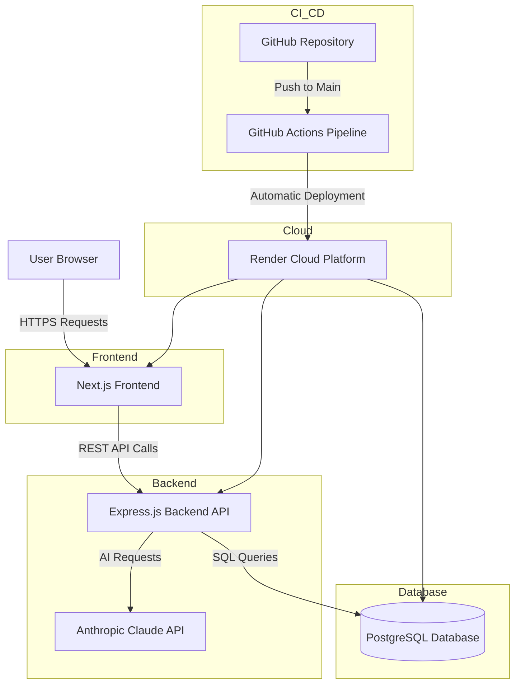

# SalesAssist AI – Cloud Deployment Project (LB2)

## Projektübersicht

SalesAssist AI ist eine KI-gestützte Webanwendung zur Unterstützung von Vertriebsteams bei der Bearbeitung von Kundenanfragen.
Die Anwendung analysiert eingehende Kundenanfragen, nutzt eine Wissensbasis und generiert automatisch professionelle Antwortsvorschläge mit Hilfe von KI.

Das Projekt wurde im Rahmen des LB2 Deployment-Projekts vollständig containerisiert und in einer Cloud-Umgebung deployt.

---

# Funktionen

* Login-System
* KI-generierte Antwortsvorschläge
* Wissensbasis für Vertriebsinformationen
* Speicherung von Chat- und Anfragehistorien
* PostgreSQL-Datenbank
* Frontend und Backend als getrennte Services
* Docker-basierte Infrastruktur
* Cloud Deployment
* CI/CD-Pipeline mit GitHub Actions

---

# Architekturübersicht

Die Anwendung besteht aus drei Hauptkomponenten:

1. Frontend (Next.js)
2. Backend API (Express.js)
3. PostgreSQL-Datenbank

Das Frontend kommuniziert über HTTPS mit dem Backend.
Das Backend verarbeitet die API-Anfragen, greift auf die PostgreSQL-Datenbank zu und kommuniziert zusätzlich mit der Anthropic Claude API zur Generierung von KI-Antworten.

---

# Architekturdiagramm



---

# Technologie-Stack

| Bereich           | Technologie          |
| ----------------- | -------------------- |
| Frontend          | Next.js + React      |
| Backend           | Node.js + Express    |
| Datenbank         | PostgreSQL           |
| KI                | Anthropic Claude API |
| Containerisierung | Docker               |
| Orchestrierung    | Docker Compose       |
| CI/CD             | GitHub Actions       |
| Deployment        | Render               |
| Versionskontrolle | GitHub               |

---

# Repository-Struktur

```text
.
├── .github
│   └── workflows
│       └── ci.yml
│
├── backend
│   ├── dist
│   ├── src
│   │   ├── config
│   │   │   └── database.ts
│   │   └── server.ts
│   ├── dockerfile
│   ├── package.json
│   └── tsconfig.json
│
├── frontend
│   ├── app
│   ├── components
│   ├── services
│   │   └── api.ts
│   ├── public
│   ├── dockerfile
│   ├── package.json
│   └── next.config.ts
│
├── database
│   └── schema.sql
│
└── docker-compose.yml
```

---

# Deployment-Architektur

| Service   | Plattform         |
| --------- | ----------------- |
| Frontend  | Render            |
| Backend   | Render            |
| Datenbank | Render PostgreSQL |

Die Anwendung ist öffentlich über HTTPS erreichbar und stabil deployt.
Frontend, Backend und Datenbank laufen als getrennte Cloud-Services auf Render.

---

# Containerisierung

Die gesamte Anwendung wurde containerisiert.

Die Docker-Konfiguration verwendet Multi-Stage-Builds zur Reduktion der Image-Grösse.
Zusätzlich laufen die Container im Produktionsmodus mit einem Non-Root-User.

## Backend

* Node.js Express API
* Docker-basierter Build-Prozess
* Environment-basierte Konfiguration
* Produktionsmodus

## Frontend

* Next.js Frontend
* Docker-basierter Build-Prozess
* Nutzung von Build Arguments für API-URLs

## Datenbank

* PostgreSQL 18
* Persistente Datenspeicherung
* Initialisierung über `schema.sql`

---

# CI/CD Pipeline

Die CI/CD-Pipeline wurde mit GitHub Actions umgesetzt.

Die Pipeline wird automatisch bei jedem Push auf den `main`-Branch ausgelöst.
Dadurch werden Build-Fehler früh erkannt und Deployments automatisiert durchgeführt.

## Automatisierte Schritte

Bei jedem Push auf den `main`-Branch:

1. Repository Checkout
2. Installation der Dependencies
3. Linting und Build des Frontends
4. Build des Backends
5. Docker Image Build
6. Automatisches Deployment auf Render

## Workflow-Datei

```text
.github/workflows/ci.yml
```

---

# Environment Variables

## Backend

```env
PORT=5000

DB_HOST=
DB_PORT=
DB_NAME=
DB_USER=
DB_PASSWORD=

ANTHROPIC_API_KEY=
```

## Frontend

```env
NEXT_PUBLIC_API_URL=
```

---

# Setup-Anleitung

## Repository klonen

```bash
git clone https://github.com/sltnaksy/lb2_salesasistant_ai_dep.git
```

---

## Docker lokal starten

```bash
docker compose up --build
```

---

# Lokale URLs

## Frontend

```text
http://localhost:3000
```

## Backend Healthcheck

```text
http://localhost:5000/health
```

---

# Cloud Deployment

## Frontend URL

```text
https://lb2-salesassistant-frontend.onrender.com
```

## Backend URL

```text
https://lb2-salesassistant-backend.onrender.com
```

---

# Produktionsreife Merkmale

| Merkmal         | Umsetzung                    |
| --------------- | ---------------------------- |
| Containerisiert | Docker + Docker Compose      |
| Automatisiert   | GitHub Actions Pipeline      |
| Konfigurierbar  | Environment Variables        |
| Erreichbar      | Öffentliche Render-URLs      |
| Überwachbar     | Healthcheck Endpoint         |
| Dokumentiert    | README + Architekturdiagramm |

---

# Qualität und Best Practices

Die Anwendung kann lokal mit einem einzigen Befehl gestartet werden:

```bash
docker compose up --build
```

Dadurch ist das Projekt reproduzierbar und einfach testbar.

Frontend, Backend und Datenbank sind klar getrennt und kommunizieren über definierte Schnittstellen.
Die Anwendung nutzt Docker, CI/CD, Environment Variables und Healthchecks für ein produktionsnahes Deployment.

---

# Entscheidungsbegründungen

## Warum Docker?

Docker wurde gewählt, um eine reproduzierbare und konsistente Laufzeitumgebung für Frontend, Backend und Datenbank bereitzustellen.
Dadurch kann die Anwendung lokal und in der Cloud identisch ausgeführt werden.

## Warum Render?

Render wurde gewählt, weil die Plattform Docker-basierte Deployments, PostgreSQL-Datenbanken und automatische Deployments über GitHub unterstützt.
Zusätzlich ermöglicht Render HTTPS und eine einfache Verwaltung mehrerer Services.

## Warum GitHub Actions?

GitHub Actions wurde verwendet, um eine automatische CI/CD-Pipeline umzusetzen.
Bei jedem Push auf den `main`-Branch werden Frontend und Backend automatisch gebaut und geprüft.

## Warum PostgreSQL?

PostgreSQL wurde verwendet, da relationale Daten wie Benutzer, Chatverläufe und Wissensbasis strukturiert gespeichert werden müssen.

## Warum Next.js und Express?

Next.js ermöglicht ein modernes React-basiertes Frontend mit guter Performance.
Express wurde gewählt, weil es leichtgewichtig und einfach mit REST-APIs kombinierbar ist.

---

# Sicherheitsmassnahmen

* Keine Secrets im Source Code
* Nutzung von Environment Variables für API Keys und Datenbankzugang
* `.env`-Dateien sind durch `.gitignore` ausgeschlossen
* `.env.example` dokumentiert benötigte Konfiguration
* HTTPS über Render
* Trennung von Frontend, Backend und Datenbank
* Dockerisierte Produktionsumgebung
* Optimierte Docker Images durch `.dockerignore`

---

# Learnings

Im Verlauf des Projekts wurden wichtige Erfahrungen im Bereich Cloud Deployment gesammelt:

* Unterschied zwischen lokalen und Cloud-Umgebungen
* Umgang mit Docker-basierten Deployments
* Konfiguration von Environment Variables
* Aufbau einer CI/CD-Pipeline
* Verbindung von Frontend, Backend und Datenbank in einer produktionsähnlichen Architektur
* Debugging von Build- und Deployment-Problemen

Besonders wichtig war das Verständnis, dass Next.js Environment Variables bereits während des Docker-Build-Prozesses korrekt eingebunden werden müssen.

---

# Reflexion

Das Projekt war deutlich komplexer als erwartet, insbesondere die Verbindung zwischen Docker, Cloud Deployment und Environment Variables.
Die grössten Schwierigkeiten entstanden bei der Kommunikation zwischen Frontend und Backend nach dem Deployment sowie bei der Konfiguration der Cloud-Datenbank.

Rückblickend würde ich die Projektstruktur und die Deployment-Architektur früher genauer planen.
Zusätzlich würde ich automatisierte Tests und Monitoring bereits am Anfang des Projekts integrieren.

Trotz der Herausforderungen hat das Projekt geholfen, moderne Deployment-Prozesse besser zu verstehen und praktische Erfahrung mit Docker, CI/CD und Cloud-Plattformen zu sammeln.

---

# Einsatz von KI-Tools

Für einzelne technische Erklärungen, Formulierungen und Debugging-Unterstützung wurden KI-Tools verwendet.
Die Implementierung, Konfiguration und das Verständnis der Deployment-Architektur wurden eigenständig durchgeführt.

---

# Autor

Sultan Aydin

Gibb HF – Informatik

LB2 Cloud Deployment Projekt-2026
